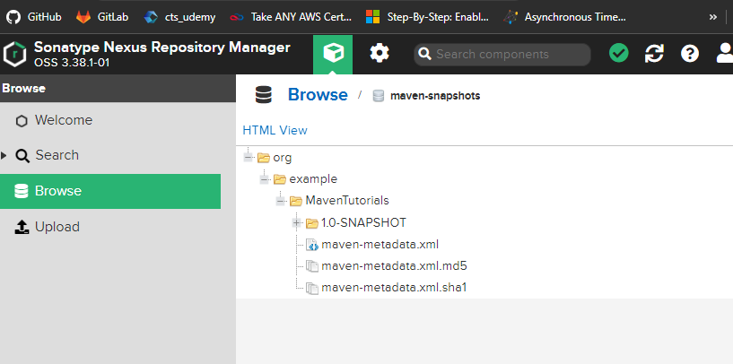

# Repository Managers
Create a custom maven repository at org level so maven will not always pull data from central repository, so first file it will be pulled from maven 
central repo and cache them local repo (i.e. org level repo).


Advantages:
1. Cached artifacts
2. Store our proj artifact (JAR, WAR)

Nexus is one such repository manager. 

Setup Nexus Sonatype repository manager on our local system:

docker run -d -p 8081:8081 --name nexus sonatype/nexus3

After that we might need to wait sometime to get the container up, then run:
http://localhost:8081/

click on "Browse" on left nav

Now sign in to login as admin and create repo

Default user is admin and the uniquely generated password can be found in the admin.password file inside the volume. 
See Persistent Data for information about the volume.

docker container exec nexus cat /nexus-data/admin.password

then i changed the password as: admin/admin

Enable anonymous access

Repository Types:
1. Hosted Repository: Host our artifacts like, JAR, WAR etc. If we mark POM as SNAPSHOT, it will go to "maven-snapshots" automatically. 
Release one, will go under "maven-releases" automatically.


2. Proxy Repository: Proxy to the maven central repo or any othre repo that is having in our org. It will cache from central repo or otehr repo.


3. Grouped Repository:  Collection of repo. Instead of having maven releases, maven snapshots and maven groups, 
we will create a maven group and that will be used within config (pom.xml). IN groupd repo, we can group multiple hosted and poxy repo.


Open http://localhost:8081/ -> login as admin -> settings -> crate repo ->  you can see you can  create maven 
hosted, group, proxy repo along with others  -> you can create them

Say i have created a grouped repo:
http://localhost:8081/repository/maven-group-repo/


settings.xml (should be under .m2 folder)
```
<?xml version="1.0" encoding="UTF-8"?>
<settings xmlns="http://maven.apache.org/SETTINGS/1.1.0"
  xmlns:xsi="http://www.w3.org/2001/XMLSchema-instance"
  xsi:schemaLocation="http://maven.apache.org/SETTINGS/1.1.0 http://maven.apache.org/xsd/settings-1.1.0.xsd">

  <!-- These users need not to be the admin user, rather, we can create user and admin will grant permission, or admin can create users -->
  <servers>
    <server>
      <id>nexus-snapshots</id>
      <username>admin</username>
      <password>admin123</password>
    </server>
    <server>
      <id>nexus-releases</id>
      <username>admin</username>
      <password>admin123</password>
    </server>
  </servers>

  <mirrors>
    <mirror>
      <id>central</id>
      <name>central</name>
      <!--url>http://localhost:8081/repository/maven-group/</url-->
      <url>http://localhost:8081/repository/maven-group/</url>        
      <mirrorOf>*</mirrorOf>
    </mirror>
  </mirrors>

</settings>

```

We have created a maven group repo names: maven-grouo-repo

Which has maven central (i.e. maven proxy), maven-snapshots and maven-releases 

Lets use it:
```
 <repositories>

        <repository>
            <id>maven-group-repo</id>
            <url>http://localhost:8081/repository/maven-group-repo/</url>
        </repository>
    </repositories>
```

If we don't add it by default it will fetch from maven central repo.
If we add it them it will fetch from local/org level repo (i.e. in my case http://localhost:8081/repository/maven-group-repo/)

Now if went to deploy my project jar to my local repo, ass distributionManagement section as shown below:
```
    <repositories>
        <repository>
            <id>maven-group-repo</id>
            <url>http://localhost:8081/repository/maven-group-repo/</url>
        </repository>
    </repositories>
    <distributionManagement>
        <snapshotRepository>
            <id>nexus-snapshot</id> <!-- any unique id we can use -->
            <url>http://localhost:8081/repository/nuget-hosted/</url>
        </snapshotRepository>
    </distributionManagement>

```

If we want to release repository as well:

```
<repositories>
        <repository>
            <id>maven-group-repo</id>
            <url>http://localhost:8081/repository/maven-group-repo/</url>
        </repository>
    </repositories>
    <distributionManagement>
        <snapshotRepository>
            <id>nexus-snapshots</id> <!-- any unique id we can use -->
            <url>http://localhost:8081/repository/nuget-hosted/</url>
        </snapshotRepository>
        <repository>
            <id>nexus-releases</id>
            <url>http://localhost:8081/repository/maven-releases/</url>
        </repository>
    </distributionManagement>
```


Now delete .m2 -> repository folder.

It will now download everything from central repo -> local repo -> .m2 ->mvn clean install  (please note i am using install not deploy)
Now go to http://localhost:8081/#browse/browse:maven-group-repo (or click on repo name -> copy the url which is for me http://localhost:8081/repository/maven-group-repo/)
-> browse (Please use the browse or HTML index views to inspect the contents of this repository.) -> you will get downloaded stuff 


now if we run mvn deploy

http://localhost:8081/repository/maven-snapshots/

here you will get the the of our prject is created.



### Mirrors:
We have added earlier mirror under settings.xml

```
  <mirrors>
    <mirror>
      <id>central</id>
      <name>central</name>
      <!--url>http://localhost:8081/repository/maven-group/</url-->
      <url>http://localhost:8081/repository/maven-group-repo/</url>        
      <mirrorOf>*</mirrorOf>
    </mirror>
  </mirrors>

```


This makes "repositories" section optional. we can delete below section and it will work as is.

```
<repositories>
        <repository>
            <id>maven-group-repo</id>
            <url>http://localhost:8081/repository/maven-group-repo/</url>
        </repository>
    </repositories>
```


final code:


```
<!--<repositories>
        <repository>
            <id>maven-group-repo</id>
            <url>http://localhost:8081/repository/maven-group-repo/</url>
        </repository>
    </repositories>-->
    <distributionManagement>
        <snapshotRepository>
            <id>nexus-snapshots</id> <!-- any unique id we can use -->
            <url>http://localhost:8081/repository/maven-snapshots/</url>
        </snapshotRepository>
        <repository>
            <id>nexus-releases</id>
            <url>http://localhost:8081/repository/maven-releases/</url>
        </repository>
    </distributionManagement>
```

ALso, to improve further in settings.xml, we can define what is to be mirror. Below will only mirror maven-central

```
  <mirrors>
    <mirror>
      <id>central</id>
      <name>central</name>
      <!--url>http://localhost:8081/repository/maven-group/</url-->
      <url>http://localhost:8081/repository/maven-group-repo/</url>        
      <mirrorOf>central</mirrorOf>
    </mirror>
  </mirrors>

```


If we have this:

settings.xml
```
<mirrors>
    <mirror>
      <id>central</id>
      <name>central</name>
      <!--url>http://localhost:8081/repository/maven-group/</url-->
      <url>http://localhost:8081/repository/maven-group-repo/</url>        
      <mirrorOf>central</mirrorOf>
    </mirror>
  </mirrors>
```

pom.xml
```
    <repositories>
        <repository>
            <id>maven-group-repo</id>
            <url>http://abc.com/zzz</url>
        </repository>
    </repositories>
```


in above situation "http://abc.com/zzz" will act as a mirror of "http://localhost:8081/repository/maven-group-repo/"
It will fetch from "http://localhost:8081/repository/maven-group-repo/"


